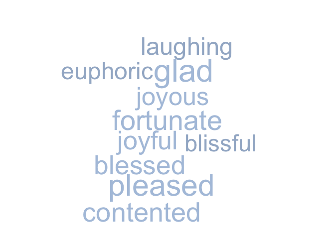

<!-- README.md is generated from README.Rmd. Please edit that file -->

# rhymer

[](https://travis-ci.org/landesbergn/rhymer)
[](https://codecov.io/github/landesbergn/rhymer?branch=master)
[](https://cran.r-project.org/package=rhymer)
[](http://cran.rstudio.com/web/packages/rhymer/index.html)

### Overview

The goal of `rhymer` is to get rhyming and other related words through
the [Datamuse API](http://www.datamuse.com/api/). This package includes
basic functions to get rhymes and other similar words based on meaning,
spelling, or sound.

## Installation

``` r
install.packages("rhymer")

# Or the the development version from GitHub:
# install.packages("devtools")
devtools::install_github("landesbergn/rhymer")
```

## Example

They say nothing rhymes with *orange*…

``` r
get_rhyme("orange", return_type = "word")
#> [1] "door hinge"
```

Feeling down? How about this cloud of words with similar meaning to
*happy*:

``` r
word_data <- get_means_like("happy", return_type = "df")
wordcloud::wordcloud(words = word_data$word, 
                     freq = word_data$score, 
                     colors = c("lightsteelblue1","lightsteelblue2","lightsteelblue3","lightsteelblue"))
```

<!-- -->

Eminem wrote the classic rap song [‘Lose
Yourself’](https://genius.com/Eminem-lose-yourself-lyrics), but could
it be better with `rhymer`?

``` r
glue::glue("
  His palms are sweaty
  Knees weak arms are {get_rhyme('sweaty', return_type = 'word', num_syl = 2)}

  There's vomit on his sweater already
  Mom's {get_rhyme('already', return_type = 'word', num_syl = 3)}
")
#>   His palms are sweaty
#>   Knees weak arms are petty
#> 
#>   There's vomit on his sweater already
#>   Mom's unsteady
```

## Main functions

`rhymer` has 4 main functions that allow you to get data on related
words through the Datamuse API.

They are:

  - `get_rhyme()` - a function to get rhyming words  
  - `get_means_like()` - a function to get words with similar meaning  
  - `get_sounds_like()` - a function to get words that sound similar  
  - `get_spelled_like()` - a function to get words that are spelled
    similarly

There is also a more flexible function `get_other_related()` that allows
you to use the API to get data on other related words using a series of
‘codes’ described on the [Datamuse API
website](http://www.datamuse.com/api/).

Each function takes the basic arguments of:

  - `word` the word to base results on  
  - `return_type` what type of data return (options are *df* for a data
    frame, *vector* for a vector, *word* for a single word, and
    *random\_word* for a random word)  
  - `limit` max number of related words to return

`get_rhyme()` and `get_sounds_like()` also have special helpers for the
number of syllables to return called `num_syl`.
